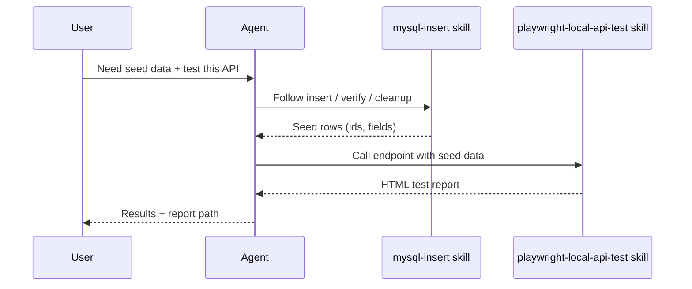
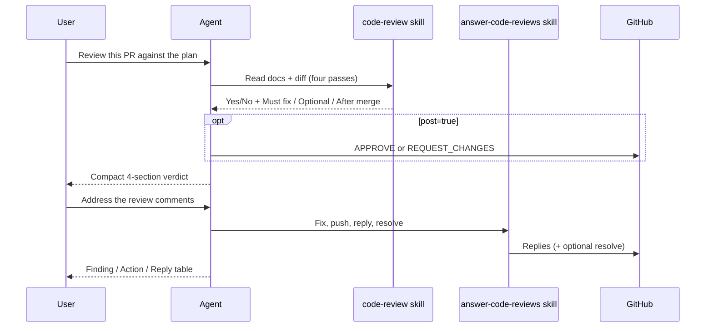

# agent-skills

Production-grade **skills** for AI coding agents (Cursor, Claude Code, Codex, and similar tools).

Think of each skill as a short playbook: when a task matches the skill’s description, the agent reads `SKILL.md` and follows that process instead of improvising.

## What’s in this repo

```text
agent-skills/
├── LICENSE
├── README.md
└── skills/
    ├── answer-code-reviews/
    │   ├── SKILL.md
    │   └── reference.md
    ├── business-process/
    │   ├── SKILL.md       # Process overview HTML workflow
    │   └── reference.md   # Infra inventory, CSS, skeleton
    ├── code-review/
    │   ├── SKILL.md       # When to use + step-by-step workflow
    │   └── reference.md   # Extra examples and details
    ├── mysql-insert/
    │   ├── SKILL.md
    │   └── reference.md
    ├── playwright-local-api-test/
    │   ├── SKILL.md
    │   └── reference.md
    ├── test-cases/
    │   ├── SKILL.md       # Positive/negative QA cases per channel
    │   └── reference.md   # HTML table snippets + tips
    └── unit-test/
        ├── SKILL.md       # Table-driven automated unit tests
        └── reference.md   # Before/after Go examples
```

| Skill | What it helps the agent do |
| --- | --- |
| [`business-process`](skills/business-process/) | Author a standalone non-technical business-process overview HTML (FE↔BE, systems, infra inventory). |
| [`test-cases`](skills/test-cases/) | Author positive/negative QA test cases (HTML or Markdown) from use cases and acceptance criteria. |
| [`unit-test`](skills/unit-test/) | Write or rewrite automated unit tests as table-driven cases (match package style, run focused tests). |
| [`code-review`](skills/code-review/) | Formal PR/branch review against agreed docs, with a clear Yes/No merge verdict (optional GitHub post). |
| [`answer-code-reviews`](skills/answer-code-reviews/) | Address PR review feedback: fix, commit/push, reply on each finding, resolve threads. |
| [`mysql-insert`](skills/mysql-insert/) | Write safe, DBeaver-ready MySQL `INSERT` / seed SQL (discover → insert → verify → cleanup). |
| [`playwright-local-api-test`](skills/playwright-local-api-test/) | Run local Playwright **API** tests against an endpoint using MySQL seed data, then write an HTML report. |

`mysql-insert` and `playwright-local-api-test` work together: seed data, then verify the API. `code-review` and `answer-code-reviews` are a pair: one posts the review, the other responds to it. `business-process` and `test-cases` are a pair: journey overview first, then QA cases. `test-cases` (human checklist) and `unit-test` (automated code tests) are different layers — do not swap them.

## How a skill is structured

Every skill folder follows the same shape:

| File | Role |
| --- | --- |
| `SKILL.md` | Main instructions (YAML frontmatter + workflow). Agents load this first. |
| `reference.md` | Deeper examples and notes. Open when `SKILL.md` points to it. |

Frontmatter at the top of `SKILL.md` tells the agent **when** to use the skill (`name` + `description`).

## How to use these skills

### Option A — Copy into a project

Copy a skill folder into your agent’s skills directory, for example:

```bash
cp -R skills/mysql-insert /path/to/your-project/.cursor/skills/
cp -R skills/business-process /path/to/your-project/.cursor/skills/
cp -R skills/playwright-local-api-test /path/to/your-project/.cursor/skills/
```

Exact install paths depend on the tool (Cursor `.cursor/skills/`, personal `~/.cursor/skills/`, etc.).

### Option B — Point your agent at this repo

Clone or symlink this repository and configure your agent to load skills from `skills/`.

```bash
git clone git@github.com-personal:prapsky/agent-skills.git
# or: git clone https://github.com/prapsky/agent-skills.git
```

## Typical flows (high level)

### Seed data + local API test



### Code review + answer feedback



1. **You** ask for seed SQL, a local API check, a business-process HTML overview, QA test cases, unit tests, a PR review, or help answering review comments.
2. **Agent** matches the request to a skill and reads `SKILL.md`.
3. **Behind the scenes:** discover data / call APIs / compare to agreement docs / research a journey / draft cases / write table-driven unit tests / fix and reply on threads.
4. **You** get SQL, an HTML report, a process overview page, a test-case table, passing unit tests, a merge verdict, or a short “what we fixed” table—not a vague essay.

## Adding a new skill

1. Create `skills/<skill-name>/`.
2. Add `SKILL.md` with `name` and `description` frontmatter.
3. Add `reference.md` when examples would clutter the main skill.
4. Update this README’s skill table.

Keep instructions short, safe by default (no production writes or secrets unless the user clearly asks), and easy for a non-expert to follow.

## License

MIT — see [LICENSE](LICENSE).
