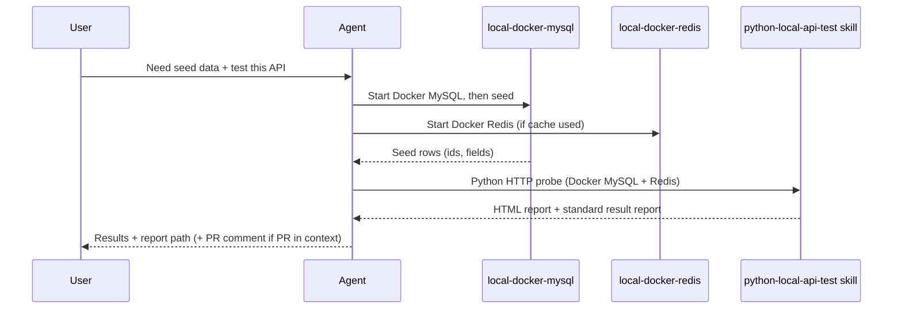
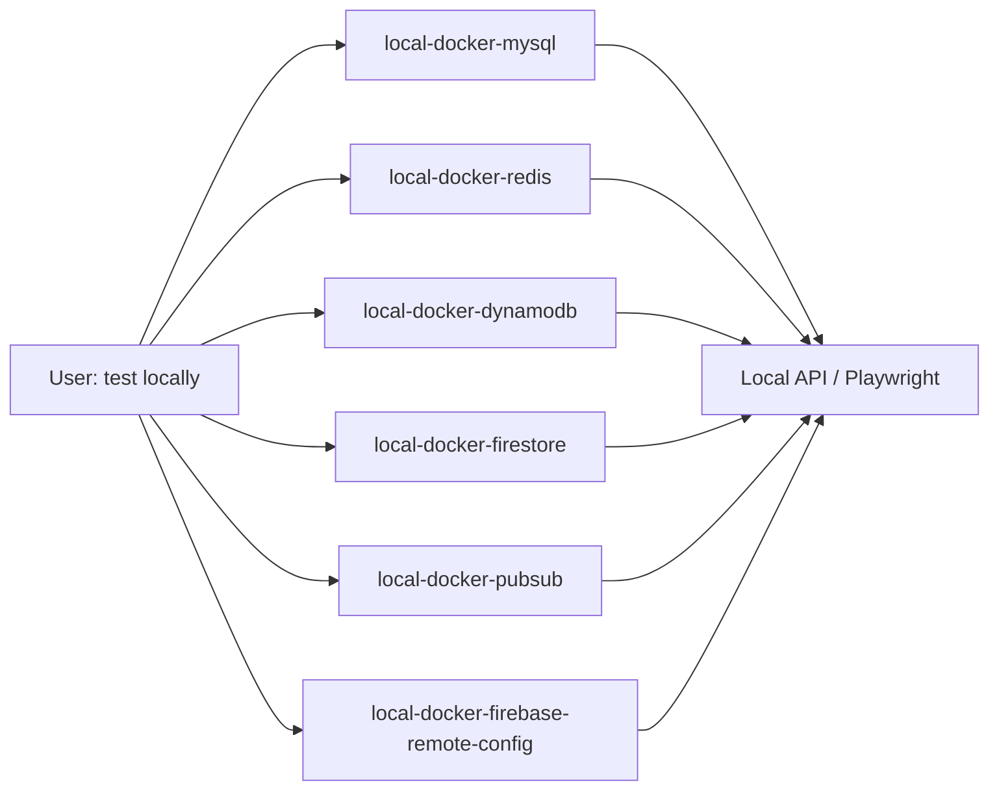
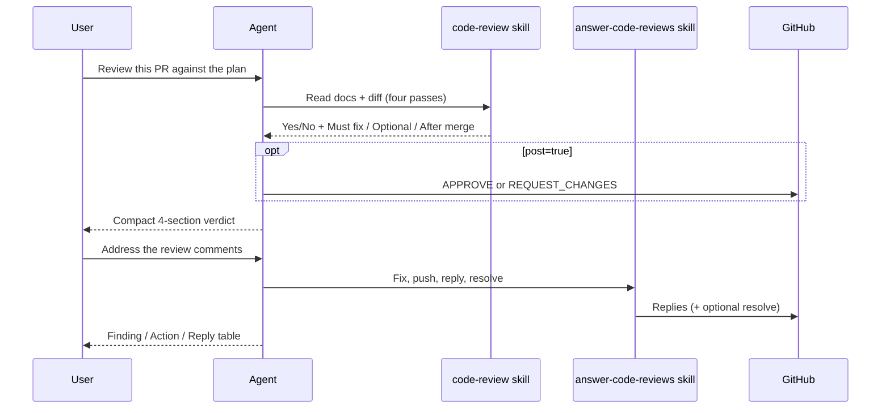

# agent-skills

Production-grade **skills** for AI coding agents (Cursor, Claude Code, Codex, and similar tools).

Think of each skill as a short playbook: when a task matches the skill’s description, the agent reads `SKILL.md` and follows that process instead of improvising.

These skills follow [Anthropic’s skill-creator guidelines](https://github.com/anthropics/skills/blob/main/skills/skill-creator/SKILL.md): pushy descriptions (what + when), imperative workflows, progressive disclosure via `references/`, and lean `SKILL.md` files.

## What’s in this repo

```text
agent-skills/
├── LICENSE
├── README.md
└── skills/
    ├── answer-code-reviews/
    ├── business-process/
    ├── code-review/
    ├── create-pull-request/
    ├── local-docker-dynamodb/
    ├── local-docker-firebase-remote-config/
    ├── local-docker-firestore/
    ├── local-docker-mysql/
    ├── local-docker-pubsub/
    ├── local-docker-redis/
    ├── playwright-local-api-test/
    ├── python-local-api-test/
    ├── test-cases/
    ├── test-data-conventions/
    └── unit-test/
```

| Skill | What it helps the agent do |
| --- | --- |
| [`business-process`](skills/business-process/) | Author a standalone non-technical business-process overview HTML (FE↔BE, systems, infra inventory). |
| [`test-cases`](skills/test-cases/) | Author positive/negative QA test cases (HTML or Markdown) from use cases and acceptance criteria. |
| [`test-data-conventions`](skills/test-data-conventions/) | Synthetic phones (`+6285YYMMDDxxx` from today’s date) and valid UUID string IDs for seeds/fixtures. |
| [`unit-test`](skills/unit-test/) | Write or rewrite automated unit tests as table-driven cases (match package style, run focused tests). |
| [`code-review`](skills/code-review/) | Formal PR/branch review against agreed docs, with a clear Yes/No merge verdict (optional GitHub post). |
| [`answer-code-reviews`](skills/answer-code-reviews/) | Address PR review feedback: fix, commit/push, reply on each finding, resolve threads. |
| [`create-pull-request`](skills/create-pull-request/) | Open a GitHub PR with a clear title, Summary, and Test plan (apply relevant skills to the diff first). |
| [`local-docker-mysql`](skills/local-docker-mysql/) | Start / seed (INSERT…SELECT) / verify / inspect local Docker MySQL (`app-mysql-local`). Replaces former `mysql-insert`. |
| [`local-docker-redis`](skills/local-docker-redis/) | Start / health-check / seed keys / scan for local Docker Redis (`app-redis-local`). |
| [`local-docker-dynamodb`](skills/local-docker-dynamodb/) | Start / tables / PutItem / scan for local DynamoDB (`app-dynamodb-local` → `:8000`). |
| [`local-docker-firestore`](skills/local-docker-firestore/) | Start / seed / read for Firestore emulator (`app-firestore-local` → `:8080`). |
| [`local-docker-pubsub`](skills/local-docker-pubsub/) | Start / topics / publish / pull for Pub/Sub emulator (`app-pubsub-local` → `:8085`, `PUBSUB_EMULATOR_HOST`). |
| [`local-docker-firebase-remote-config`](skills/local-docker-firebase-remote-config/) | Seed / mock Firebase Remote Config for local feature flags (`app-firebase-rc-local` → `:9299` and/or Redis FF cache). |
| [`python-local-api-test`](skills/python-local-api-test/) | Run local **HTTP API** tests with **Python** against Docker stores; always deliver the standard result report. Prefer this over Playwright for APIs. |
| [`playwright-local-api-test`](skills/playwright-local-api-test/) | **UI / browser** Playwright only — redirect HTTP API work to `python-local-api-test`. |

`local-docker-*` skills are company-agnostic defaults (`app-*-local`). Rename containers/creds per project. `local-docker-mysql` and `python-local-api-test` work together for relational API tests; add Redis/Dynamo/Firestore/Pub/Sub/Remote Config skills when those stores are in the path. Playwright is for UI only. `code-review` and `answer-code-reviews` are a pair. `business-process` and `test-cases` are a pair. `test-cases` (human checklist) and `unit-test` (automated code tests) are different layers — do not swap them.

## How a skill is structured

Every skill folder follows Anthropic-style progressive disclosure:

```text
skill-name/
├── SKILL.md                 # Required — frontmatter + workflow (keep lean)
└── references/              # Optional — deeper recipes loaded only when needed
    └── reference.md
```

| File | Role |
| --- | --- |
| `SKILL.md` | Main instructions (YAML `name` + pushy `description`, then imperative workflow). Agents load this when the skill triggers. |
| `references/` | Deeper examples, SQL/CLI recipes, HTML/CSS skeletons. Open when `SKILL.md` points to them. |

Frontmatter at the top of `SKILL.md` tells the agent **what** the skill does and **when** to use it. Descriptions include trigger phrases and near-miss redirects so skills fire at the right times.

## How to use these skills

### Option A — Copy into a project

Copy a skill folder into your agent’s skills directory, for example:

```bash
cp -R skills/local-docker-mysql /path/to/your-project/.cursor/skills/
cp -R skills/local-docker-redis /path/to/your-project/.cursor/skills/
cp -R skills/local-docker-dynamodb /path/to/your-project/.cursor/skills/
cp -R skills/local-docker-firestore /path/to/your-project/.cursor/skills/
cp -R skills/local-docker-pubsub /path/to/your-project/.cursor/skills/
cp -R skills/local-docker-firebase-remote-config /path/to/your-project/.cursor/skills/
cp -R skills/python-local-api-test /path/to/your-project/.cursor/skills/
```

Exact install paths depend on the tool (Cursor `.cursor/skills/`, personal `~/.cursor/skills/`, etc.).

### Option B — Point your agent at this repo

Clone or symlink this repository and configure your agent to load skills from `skills/`.

```bash
git clone git@github.com-personal:prapsky/agent-skills.git
# or: git clone https://github.com/prapsky/agent-skills.git
```

## Typical flows (high level)

### Seed data + local API test



### Multi-store local preflight



### Code review + answer feedback



1. **You** ask for seed SQL, a local API check, a business-process HTML overview, QA test cases, unit tests, a PR review, or help answering review comments.
2. **Agent** matches the request to a skill and reads `SKILL.md`.
3. **Behind the scenes:** discover data / call APIs / compare to agreement docs / research a journey / draft cases / write table-driven unit tests / fix and reply on threads.
4. **You** get SQL, an HTML report plus the standard local-test result report, a process overview page, a test-case table, passing unit tests, a merge verdict, or a short “what we fixed” table—not a vague essay.

## Adding a new skill

Follow Anthropic’s skill-creator loop: capture intent → draft → test with real prompts → review → improve description triggering.

1. Create `skills/<skill-name>/`.
2. Add `SKILL.md` with `name` and a pushy `description` (what it does **and** when to use it, plus near-miss redirects).
3. Put deep recipes under `references/` and link them from `SKILL.md` (“read this when…”).
4. Prefer imperative steps and explain *why*; keep `SKILL.md` under ~500 lines.
5. Update this README’s skill table.

Keep instructions short, safe by default (no production writes or secrets unless the user clearly asks), and easy for a non-expert to follow.

## License

MIT — see [LICENSE](LICENSE).
