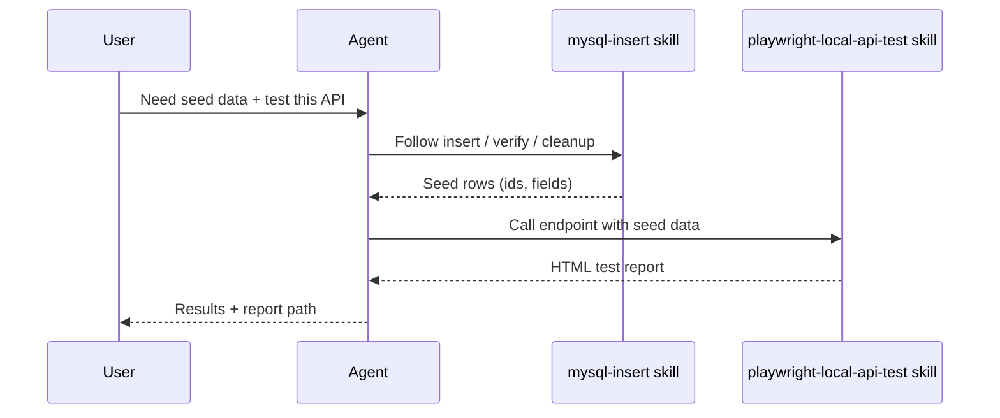

# agent-skills

Production-grade **skills** for AI coding agents (Cursor, Claude Code, Codex, and similar tools).

Think of each skill as a short playbook: when a task matches the skill’s description, the agent reads `SKILL.md` and follows that process instead of improvising.

## What’s in this repo

```text
agent-skills/
├── LICENSE
├── README.md
└── skills/
    ├── mysql-insert/
    │   ├── SKILL.md       # When to use + step-by-step workflow
    │   └── reference.md   # Extra examples and details
    └── playwright-local-api-test/
        ├── SKILL.md
        └── reference.md
```

| Skill | What it helps the agent do |
| --- | --- |
| [`mysql-insert`](skills/mysql-insert/) | Write safe, DBeaver-ready MySQL `INSERT` / seed SQL (discover → insert → verify → cleanup). |
| [`playwright-local-api-test`](skills/playwright-local-api-test/) | Run local Playwright **API** tests against an endpoint using MySQL seed data, then write an HTML report. |

These two skills are meant to work together: seed data with `mysql-insert`, then verify the API with `playwright-local-api-test`.

## How a skill is structured

Every skill folder follows the same shape:

| File | Role |
| --- | --- |
| `SKILL.md` | Main instructions (YAML frontmatter + workflow). Agents load this first. |
| `reference.md` | Deeper examples and notes. Open when `SKILL.md` points to it. |

Frontmatter at the top of `SKILL.md` tells the agent **when** to use the skill (`name` + `description`).

## How to use these skills

### Option A — Copy into a project

Copy a skill folder into your agent’s skills directory, for example:

```bash
cp -R skills/mysql-insert /path/to/your-project/.cursor/skills/
cp -R skills/playwright-local-api-test /path/to/your-project/.cursor/skills/
```

Exact install paths depend on the tool (Cursor `.cursor/skills/`, personal `~/.cursor/skills/`, etc.).

### Option B — Point your agent at this repo

Clone or symlink this repository and configure your agent to load skills from `skills/`.

```bash
git clone git@github.com-personal:prapsky/agent-skills.git
# or: git clone https://github.com/prapsky/agent-skills.git
```

## Typical flow (high level)



1. **You** ask for seed SQL or a local API check.
2. **Agent** matches the request to a skill and reads `SKILL.md`.
3. **Backend-style work** (behind the scenes): discover related rows, insert safely, call the API, write a report.
4. **You** get copy-paste SQL and/or an HTML report—not a mystery one-off script.

## Adding a new skill

1. Create `skills/<skill-name>/`.
2. Add `SKILL.md` with `name` and `description` frontmatter.
3. Add `reference.md` when examples would clutter the main skill.
4. Update this README’s skill table.

Keep instructions short, safe by default (no production writes or secrets unless the user clearly asks), and easy for a non-expert to follow.

## License

MIT — see [LICENSE](LICENSE).
